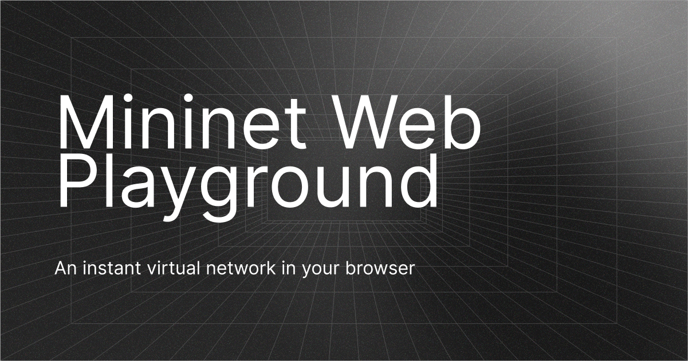
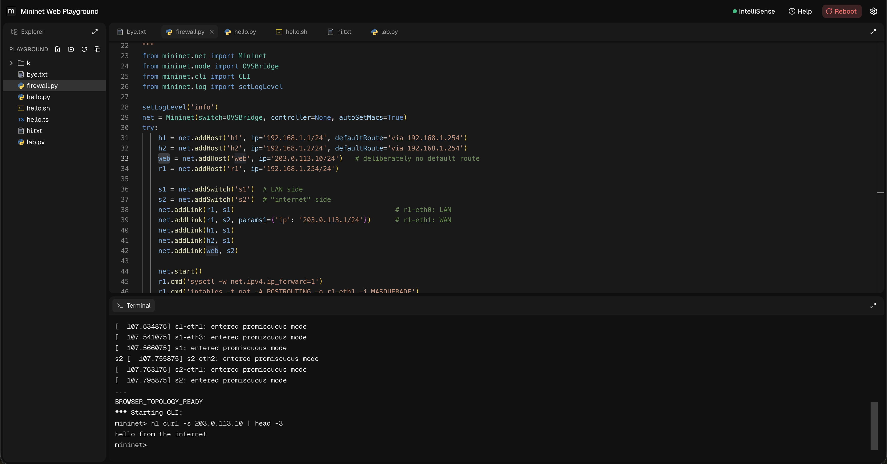

# Mininet Web



[Mininet](https://mininet.org) is great for learning network topologies and experimenting with software defined network (SDN) prototypes. This project is a React SPA that works like a small IDE: a file explorer, a code editor, and an interactive Mininet terminal, in panes you can rearrange. Linux, Mininet, and Open vSwitch run locally in a [v86](https://copy.sh/v86) emulation browser worker, so you can get started immediately with no installation required.

I hope this can be a helpful resource and reduces the barrier for people to learn about networks and SDN!



## Development

Requires Node.js 22.12+ and Yarn 4.9.2.

```sh
yarn install --immutable
yarn dev
```

Vite serves the app at `http://127.0.0.1:5173`. Click **Boot** to start the guest. The guest image is created from the Dockerfile at build-time, and bundled as static site assets. Docker is not needed to run or deploy the app.

## Manual Cloudflare deployment

`wrangler.jsonc` configures a Worker named `mininet-web` with [Workers Static Assets and SPA fallback](https://developers.cloudflare.com/workers/static-assets/routing/single-page-application/). It has no server-side entrypoint, API, bindings, or secrets. Change the Worker name before deploying if needed. The deployment will use the Cloudflare account selected by your Wrangler authentication.

```sh
# Inspect packaging locally; this does not deploy.
yarn deploy:check

# Serve the production build in the local Workers runtime.
yarn preview
# Open http://127.0.0.1:8787

# When ready, authenticate and deploy manually.
yarn wrangler login
yarn deploy
```

Wrangler's custom build runs `yarn build` before previewing or deploying. The build typechecks the app and browser worker, bundles the React SPA, copies the VM files, and verifies guest-image hashes and asset sizes. `dist/` is generated and ignored by Git.

The guest is split into chunks below the per-file static-asset limit. All emulator and guest URLs are same-origin under `/vm/`; Vite's hashed application bundles are under `/assets/`. Use HTTPS outside localhost because image verification uses Web Crypto. No cross-origin isolation headers are required.

## App structure

```text
src/
  App.tsx                    Terminal session, VM hook, and the workspace shell
  workspace/Workspace.tsx    Dockview layout, open files, and layout persistence
  workspace/panels.tsx       Explorer, terminal, welcome and file panels; tabs
  explorer/Explorer.tsx      File tree (headless-tree): select, rename, drag to move
  editor/                    Monaco loading, the editor view, and open documents
  editor/intellisense/       Opt-in Python language server (basedpyright) and its Monaco providers
  components/Terminal.tsx    xterm.js session, mounting, input, and resize
  components/TopBar.tsx      Status, reboot, View menu, and storage warnings
  hooks/useVirtualMachine.ts Worker lifecycle and readiness
  vm/emulator.worker.ts      Typed v86 startup, serial I/O, and file requests
  vm/9p/                     9P2000.L server for /root/playground (OPFS or memory)
  vm/fs-protocol.ts          Host file operations served by the worker
  vm/fs-client.ts            Main-thread client for those operations
  vm/messages.ts             Typed worker message protocol
public/vm/                   Kernel, initramfs chunks, emulator, BIOS, notices
public/pyright/              Language server worker (vendored) and the guest's Mininet source
guest/                       Linux image build and Mininet topology source
scripts/                     Asset packaging and headless VM verification
wrangler.jsonc               Manual Workers deployment configuration
```

The network starts in OVS standalone learning mode; no SDN controller is bundled. The shell starts in `/root/playground` (`~/playground`); files there are saved in the browser; the rest of the guest filesystem is not persisted.

The worker serves `/root/playground` to the guest over 9P and to the page through the same server, so the Explorer and editor see what the shell sees, and the worker reports the guest's changes back to them. When OPFS is locked by another tab or unavailable, the same folder is served from memory instead: the Explorer and editor keep working, and the files last until the reload. The pane layout is saved in `localStorage`.

IntelliSense is off by default. Turning it on (the switch in the top bar while a file is open, or Settings) starts [basedpyright](https://docs.basedpyright.com) in web workers the first time a Python file is open, and gives completions, hovers, signature help, semantic colouring and error checking, including for the Mininet API. Nothing is sent anywhere: the server runs in the browser, reading the playground's Python files and `public/pyright/mininet.json`, the Mininet source exported from the guest image by `yarn build:guest`.

## Checks

```sh
yarn build
yarn test:vm
yarn deploy:check
```

The headless test boots the bundled kernel and image in v86. It verifies distinct Linux network namespaces, successful pings, OVS ports, packet loss after disconnecting a link, recovery after reconnecting it, OpenFlow table access, and CLI exit. `verification/v86-smoke.log` contains a recorded run. This test does not create a Docker-based lab or connect to a backend.

## Rebuilding the Linux guest

Only needed when changing software inside the guest or `guest/lab.py`. Requires Docker with `linux/386` support.

```sh
yarn build:guest
yarn test:vm
yarn build
```

`guest/Dockerfile` creates an Alpine x86 environment with Mininet 2.3.0, Python, OVS, and networking utilities. It compiles `mnexec` and includes the namespace, veth, OVS, and link-shaping kernel modules. `scripts/build-guest.sh` exports the kernel and compressed initramfs to `public/vm/`.

`guest/packages.txt` and `guest/kernel.config` record the image's package versions and kernel configuration. Alpine's package repository can supply newer patch versions on a future rebuild; the committed guest chunks are fixed and SHA-256 verified.

## Runtime footprint

The download is approximately 39 MiB. The VM uses 512 MiB of configured guest RAM, plus emulator and browser overhead. With IntelliSense on, the language server adds a download of about 3 MiB compressed (18 MiB uncompressed) and roughly 500 MiB of memory. All Mininet hosts share one guest kernel. Performance and packet timings are influenced by CPU emulation and browser scheduling.

## License

The application source in this repository is released under the [MIT License](LICENSE).

## Third-party software

These components are distributed with the app and stay under their own licenses:

- [v86](https://github.com/copy/v86), 0.5.381 — BSD-2-Clause; `public/vm/v86.LICENSE`.
- [Mininet 2.3.0](https://github.com/mininet/mininet/tree/2.3.0) — BSD; license inside the guest at `/usr/share/licenses/mininet/LICENSE` and in `public/pyright/mininet.json`.
- [xterm.js](https://github.com/xtermjs/xterm.js) — MIT; notices in `public/vm/`.
- [Monaco Editor](https://github.com/microsoft/monaco-editor) — MIT.
- [Dockview](https://github.com/dockview/dockview) — MIT.
- [Headless Tree](https://github.com/lukasbach/headless-tree) — MIT.
- [basedpyright](https://github.com/DetachHead/basedpyright), browser build 1.40.1 — MIT; `public/pyright/basedpyright.LICENSE`. It bundles [typeshed](https://github.com/python/typeshed) (Apache-2.0).
- [Alpine Linux](https://alpinelinux.org/) — component-specific licenses; [source recipes](https://gitlab.alpinelinux.org/alpine/aports/-/tree/3.21-stable).
- [Open vSwitch](https://www.openvswitch.org/) — userspace Apache-2.0; kernel datapath GPL-2.0.
- [SeaBIOS](https://www.seabios.org/) — LGPLv3; [source](https://git.seabios.org/seabios.git/). BIOS files originate from the official v86 repository.
